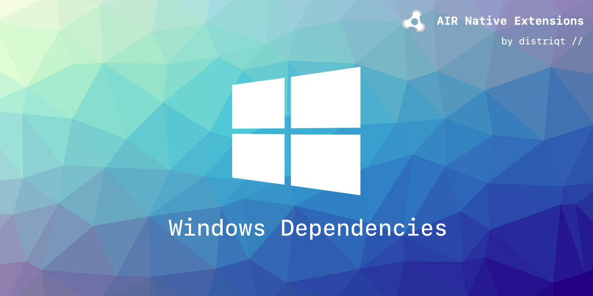

# Windows

This repository contains dependency extensions for use with distriqt's AIR Native Extensions on Windows. 

## C++ Redistributable

The native code packaged in most of our extensions has a dependency on the Visual C++ 2017 Redistributable package. This package contains code that is required to run code developed using C++ in Visual Studio and is very common amongst Windows applications.

This extension is designed to simplify the process of adding these dependencies to your application, by packaging these `dll` dependencies into an extension and making them available to other extensions. 

This makes adding the Visual C++ 2017 Redistributable `dll`s to your application simply a matter of including this extension. There are no extra requirements.

- [`com.distriqt.windows.cppredist`](https://github.com/distriqt/ANE-Windows/raw/master/lib/com.distriqt.windows.cppredist.ane)

This extension contains the `dll` libraries required by our extensions.

There are alternative ways to ensure these libraries are available to your application:

- Create an installer that runs the redistributable installer;
- Package the required DLL files from the redistributable with your application;

Each has advantages over using the extension but increases the work involved. 

### Alternative: Creating an Installer

There are many methods to create application installers and many tutorials available. We suggest you find a method suitable to your environment and application and utilise the tutorials online. 

Some methods include:

- [Inno Setup](http://www.jrsoftware.org/isinfo.php)
- [Wix](http://wixtoolset.org/)
    - [WixEdit](http://wixedit.sourceforge.net)

Tutorials:

- [Generating a Windows installer](http://www.adobe.com/devnet/air/articles/customize-setup-for-AIR-app-with-captive-runtime.html)

You need to include the x86 c++ 2017 redistributable in the installer, there are many examples and documentation online to achieve this.

>
> **The advantage of this method is that the libraries will be updated along with any system updates and will not require manual updating of the libraries and releasing of your application.**
>

### Alternative: Packaging DLLs

Packaging the DLLs into your application involves including a version of the DLLs specified below in your application.

This extension requires:

- `msvcp140.dll`
- `vcruntime140.dll`

You can acquire these libraries from the redistributable package and package them at the root of your application. This is essentially the same as including the `com.distriqt.windows.cppredist` extension, however you can update the libraries separately from our extension if there are cricital updates you need to release.

>
> Do not include both the `com.distriqt.windows.cppredist` extension and the `dll` files.
>

## Native Extensions

The highest quality and widest range of Native Extensions for Adobe AIR

With over 40 extensions available, we are the largest provider of native extensions for AIR developers. 
Our mobile solutions allow developers to fast-forward development and focus on building great games and apps.

https://airnativeextensions.com

